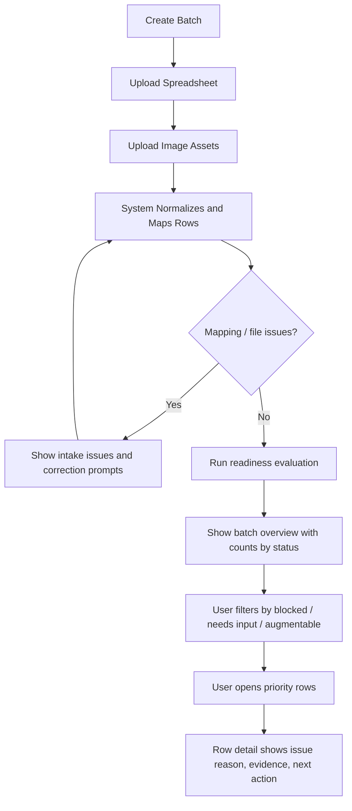
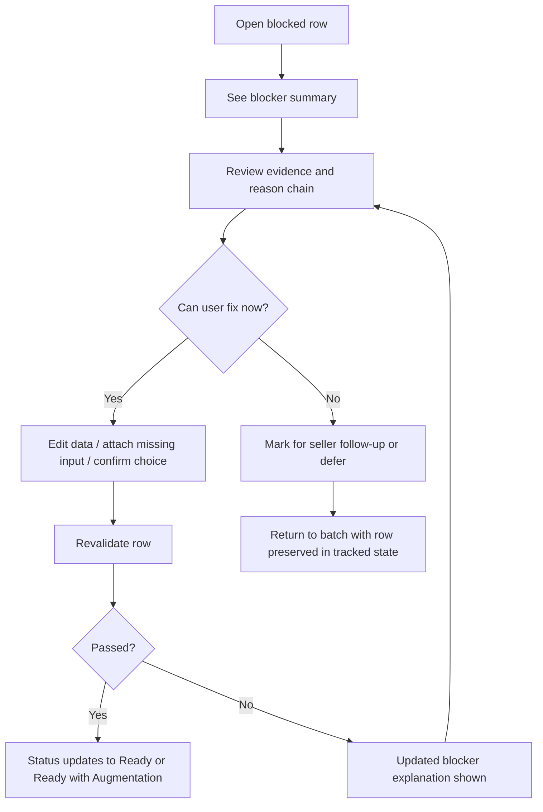
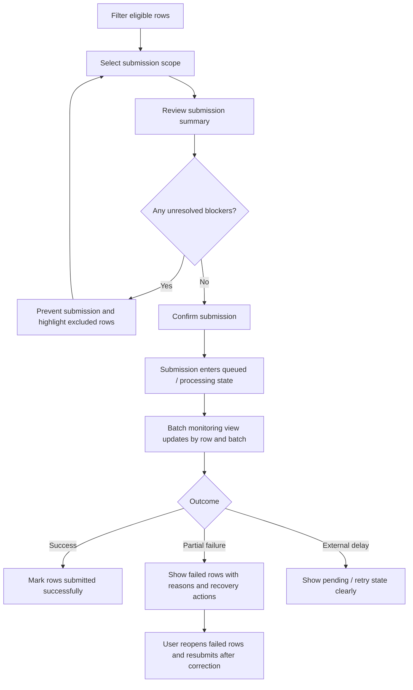

---
stepsCompleted:
  - 1
  - 2
  - 3
  - 4
  - 5
  - 6
  - 7
  - 8
  - 9
  - 10
  - 11
  - 12
  - 13
  - 14
inputDocuments:
  - "d:/Terminal/Terminal/Bulk-SKU-Creator/_bmad-output/planning-artifacts/prd.md"
  - "d:/Terminal/Terminal/Bulk-SKU-Creator/_bmad-output/planning-artifacts/product-brief-Bulk-SKU-Creator.md"
  - "d:/Terminal/Terminal/Bulk-SKU-Creator/_bmad-output/planning-artifacts/product-brief-Bulk-SKU-Creator-distillate.md"
  - "d:/Terminal/Terminal/Bulk-SKU-Creator/_bmad-output/planning-artifacts/architecture.md"
---

# UX Design Specification Bulk-SKU-Creator

**Author:** 7egazy
**Date:** 2026-04-25

---

<!-- UX design content will be appended sequentially through collaborative workflow steps -->

## Executive Summary

### Project Vision

Bulk-SKU-Creator is a SaaS workflow product for turning messy product spreadsheets and uploaded assets into trustworthy, submission-ready Amazon listing batches. From a UX perspective, the product succeeds when it makes complex operational work feel legible, controlled, and safe rather than brittle or opaque.

### Target Users

Primary users are catalog operators managing batch uploads, row validation, correction, and submission. Secondary users are operations administrators overseeing defaults, governance, and batch outcomes. Support users need deep traceability for troubleshooting. Because the product is SaaS, all of this sits inside organization-scoped workspaces with role-sensitive access patterns.

### Key Design Challenges

- Designing a high-density batch review interface that remains understandable under large row counts and many status conditions
- Making row-level blockers, AI confidence, and lifecycle transitions understandable without overwhelming users
- Helping users move fluidly between batch orchestration, row-level correction, and support-grade traceability
- Building trust in AI-assisted workflows without letting the interface overstate certainty or hide risk

### Design Opportunities

- Create a differentiated bulk-operations experience that is faster and clearer than spreadsheet-heavy or Seller Central-adjacent workflows
- Use progressive disclosure to make a complex system feel structured rather than intimidating
- Turn row detail into a confident decision workspace instead of a generic edit form
- Make SaaS organization context, permissions, and support flows feel integrated from the start

## Core User Experience

### Defining Experience

The core experience of Bulk-SKU-Creator is a high-confidence operational review loop:

1. upload a batch
2. understand what the system found
3. see what is ready, blocked, risky, or incomplete
4. resolve the important issues quickly
5. submit only what is trustworthy

The product's value is not "automation happened." The value is that users can move from uncertainty to confident action with less effort and less risk.

### Platform Strategy

- Primary platform: **web SaaS application**
- Primary interaction model: **desktop-first, mouse + keyboard**
- Secondary support: laptop and narrower desktop widths; smaller-screen review flows may exist, but authoring and dense correction workflows are desktop-first
- Offline use is not a priority for MVP
- The UI should assume long sessions, dense information, table-heavy review, side panels, filtering, and repeated operator actions

### Effortless Interactions

These should feel nearly frictionless:

- uploading spreadsheet + image assets
- understanding row status at a glance
- filtering to only the rows that need attention
- opening a row and immediately seeing what is wrong, why, and what to do next
- distinguishing safe AI help from risky or blocked automation
- moving back and forth between batch-level and row-level work without losing context
- selecting only valid rows for submission

The product should remove "where do I even start?" and replace it with a clear triage path.

### Critical Success Moments

The make-or-break moments are:

- **first batch interpretation:** the user uploads a messy batch and immediately understands the state of work
- **first blocked-row resolution:** the system explains a failure clearly enough that the user knows the exact next action
- **first trust decision around AI:** the interface makes AI help feel controlled, not mysterious
- **submission moment:** the user feels confident that only the right rows are being sent
- **post-submission traceability:** the user can clearly understand what succeeded, failed, and why

If any of these moments feel ambiguous, trust drops sharply.

### Experience Principles

- **Clarity before speed:** the UI should always explain state before trying to feel clever
- **Progressive disclosure over clutter:** batch views summarize, row views explain
- **Trust is the product:** AI, validation, and submission states must feel inspectable and accountable
- **One next action at a time:** every blocked or risky state should point users toward the next useful move
- **Operational flow over decorative UI:** this is a serious workflow product, not a marketing shell

## Desired Emotional Response

### Primary Emotional Goals

The primary emotional goal is **confident control**. Users should feel that the system understands the batch, is surfacing reality honestly, and is helping them act safely. They should never feel that the product is bluffing, hiding risk, or asking them to trust opaque automation.

A secondary emotional goal is **relief through clarity**. The product should reduce the mental load of operational mess. Users come in with ambiguity, inconsistency, and risk; the interface should convert that into structure, explanation, and next steps.

### Emotional Journey Mapping

- **First discovery:** users should feel oriented, not intimidated
- **After upload:** users should feel that chaos became legible
- **During triage:** users should feel supported and competent, not buried in friction
- **During AI-assisted review:** users should feel informed and cautious in a healthy way, not blindly optimistic
- **At submission:** users should feel deliberate and confident
- **After results return:** users should feel that outcomes are understandable and recoverable, even when some rows fail
- **On return use:** users should feel familiarity, speed, and operational mastery

### Micro-Emotions

The most important micro-emotions here are:
- **confidence over confusion**
- **trust over skepticism**
- **calm over anxiety**
- **accomplishment over frustration**
- **clarity over cognitive overload**
- **support over abandonment when something fails**

This product should not create adrenaline. It should create composure.

### Design Implications

- To create **confidence**, the interface must explain row state, AI confidence, and blockers plainly
- To create **trust**, the product must distinguish facts, inferences, warnings, and blocked actions clearly
- To create **calm**, the UI must prioritize hierarchy, whitespace, grouping, and progressive disclosure instead of crowding everything into one surface
- To create **accomplishment**, the system should make resolved work visible and let users feel progress through the batch
- To reduce **anxiety**, failure states must always show a next action rather than a dead end
- To support **relief**, the batch view should feel like a triage console, not a spreadsheet with prettier styling

### Emotional Design Principles

- **Honesty builds trust:** never visually overstate certainty
- **Clarity reduces stress:** every important status must be understandable quickly
- **Progress should be visible:** users should feel movement through work, not endless inspection
- **Failures should remain workable:** bad states must feel recoverable
- **Serious workflow, humane presentation:** the product should respect the weight of operational work without feeling cold or punishing

## UX Pattern Analysis & Inspiration

### Inspiring Products Analysis

**Linear**
- Excellent at making complex work feel focused and calm
- Strong information hierarchy
- Clear status language and purposeful density
- Useful inspiration for batch states, issue triage, and operator focus

**Notion**
- Very good at progressive disclosure and structured detail
- Lets users move between overview and drill-down without losing mental context
- Useful inspiration for row detail, side panels, expandable sections, and contextual metadata

**Airtable**
- Strong reference for high-density grid workflows
- Good at filtering, sorting, field grouping, and record inspection
- Useful inspiration for batch tables, row state scanning, and switching between tabular and detail views

**Stripe Dashboard**
- Strong trust cues for operational products
- Serious tone without feeling hostile
- Good use of status, explanation, and business-critical detail
- Useful inspiration for submission history, auditability, and support/admin views

### Transferable UX Patterns

**Navigation Patterns**
- A persistent workspace shell with clear organization context
- Primary navigation by workflow area: batches, rows, defaults, support, admin
- In-context secondary navigation inside a batch rather than deep page fragmentation

**Interaction Patterns**
- High-density table with strong filtering and status chips
- Row detail opened in a dedicated detail panel or route with preserved batch context
- Progressive disclosure for AI reasoning, validation explanations, and audit trails
- Bulk actions only when the current filtered set is clearly understood

**Visual Patterns**
- Calm, restrained visual language with strong hierarchy
- Serious use of color: status and risk only, not decorative overload
- Dense but breathable spacing that supports long work sessions
- Clear distinction between summary surfaces and diagnostic surfaces

### Anti-Patterns to Avoid

- Making the batch view feel like a prettier spreadsheet with no real triage support
- Hiding important status reasoning behind vague icons or hover-only interactions
- Overusing bright colors, badges, and “AI” emphasis in ways that reduce trust
- Mixing too many UI paradigms at once: cards, tables, modals, drawers, and step flows without a dominant interaction model
- Forcing users through wizard-like flows for work that is inherently iterative and non-linear
- Making blocked states feel punitive instead of recoverable

### Design Inspiration Strategy

**What to Adopt**
- Linear-style focus and hierarchy for triage clarity
- Airtable-style table fluency for batch review
- Notion-style progressive disclosure for row detail and supporting context
- Stripe-style trust language and operational seriousness for admin, audit, and submission surfaces

**What to Adapt**
- Table-heavy interactions must be adapted for this domain's risk and validation complexity, not copied directly
- Detail panes and nested views should be simplified so they stay fast in an operational workflow
- Status systems should be more explicit than most inspiration products because trust is central here

**What to Avoid**
- Over-designed "AI workspace" aesthetics that feel trendy but reduce legibility
- Generic SaaS dashboard sameness that hides domain-specific urgency
- Over-gamified delight patterns that conflict with the product's need for confidence and control

## Design System Foundation

### 1.1 Design System Choice

Use a **themeable design system** built around:

- `Tailwind CSS` for design-token-driven styling
- `shadcn/ui`-style component primitives as the base component layer
- a thin internal component system for domain-specific patterns such as:
  - batch status tables
  - validation panels
  - row-detail inspectors
  - submission-state indicators
  - audit / trace timelines

This gives you a flexible foundation that works well with Lovable-generated frontend output while still keeping the UI system controlled and coherent.

### Rationale for Selection

This is the best fit because:

- it supports **speed without giving up control**
- it works naturally with **Vite + React**
- it is well suited to **prompt-generated UI iteration**
- it allows strong customization for a more distinctive SaaS product
- it avoids the visual and structural rigidity of heavier pre-opinionated libraries
- it is a better match for **high-density operational interfaces** than a purely marketing-oriented component approach

Compared with the alternatives:

- **Custom design system**
  - best for full uniqueness
  - too heavy for current stage and would slow execution
- **Established system like Material UI / Ant Design**
  - faster at first
  - weaker brand differentiation
  - more likely to impose patterns that don't fit this workflow cleanly
- **Themeable system**
  - best balance of speed, flexibility, and maintainability

### Implementation Approach

The implementation approach should be:

- establish **design tokens first**:
  - color roles
  - typography scale
  - spacing scale
  - radius
  - elevation
  - data-density rules
- use the base component layer for common UI primitives:
  - buttons
  - inputs
  - selects
  - dialogs
  - tables
  - badges
  - tabs
  - drawers
  - tooltips
- create a second layer of **workflow-specific components** for the product's core UX:
  - row status summary bar
  - batch review grid
  - blocker explanation card
  - AI confidence panel
  - image-plan review module
  - submission monitor views
- keep generated UI from Lovable inside those system constraints rather than allowing page-by-page drift

### Customization Strategy

The customization strategy should be deliberate:

- avoid default "startup SaaS" styling
- define a visual language that feels:
  - operational
  - calm
  - precise
  - trustworthy
- use color primarily for:
  - readiness state
  - risk
  - warnings
  - success/failure
- keep typography and spacing tuned for **dense work**, not airy marketing pages
- introduce a few strong, recognizable product patterns:
  - triage-oriented table design
  - structured diagnostic side panels
  - clear fact vs inference vs warning treatment
  - visible progress indicators across batch workflows

The goal is not novelty for its own sake. The goal is a recognizable, serious SaaS interface that can scale across complex operational workflows.

## 2. Core User Experience

### 2.1 Defining Experience

The defining experience is a triage-and-resolution workflow where users upload a product batch, immediately see what is trustworthy versus blocked, and move the batch toward safe submission with minimal uncertainty.

What makes this special is that the system does not just process rows. It converts operational ambiguity into explicit decisions:

- what is ready now
- what can be safely augmented
- what needs human input
- what must not move forward

The product wins when users feel they are steering a controlled operations console rather than wrestling a spreadsheet or trusting blind automation.

### 2.2 User Mental Model

Users will arrive with a spreadsheet mental model because that is how this work usually starts. They think in rows, columns, missing cells, image mismatches, and repetitive cleanup. They also likely carry some Seller Central mental baggage: submission friction, vague failures, and too much manual checking.

Their expectation is not "teach me a new paradigm." Their expectation is:

- show me what is wrong
- tell me what matters first
- help me fix it quickly
- do not let me submit bad data

So the UX should preserve familiar batch-review concepts while upgrading them into a better mental model:

- from spreadsheet rows to row states
- from scattered errors to actionable blockers
- from manual guesswork to guided readiness decisions
- from opaque submission risk to explicit confidence

The main confusion risks are:
- not understanding why a row got its status
- not knowing whether AI content is safe or speculative
- losing context when moving between batch view and row detail
- not knowing whether a problem is fixable now, later, or not at all

### 2.3 Success Criteria

Users should say "this just works" when the system makes a messy batch understandable within minutes and gives them a clear path to action.

The core interaction is successful when:

- users can identify the highest-priority blocked rows immediately
- users can understand a row's readiness without opening multiple screens
- users can resolve common issues without leaving the workflow
- users can distinguish safe AI help from required human input
- users feel confident selecting a subset of rows for submission
- users understand what happened after submission without support intervention

The strongest feedback signals are:

- visible movement from blocked to ready states
- precise explanations attached to each problem
- clear confirmation that only eligible rows are being submitted
- understandable submission outcomes at both row and batch level

### 2.4 Novel UX Patterns

This experience should mostly use established patterns, but combine them in a more disciplined way than most listing tools do.

**Established patterns to rely on:**
- high-density batch tables
- filters and saved views
- side-panel or detail-route inspection
- status chips and validation summaries
- queue/progress feedback for async work

**Where the product adds a distinctive twist:**
- readiness is not just pass/fail; it is a structured operational state model
- AI is presented as constrained assistance, not as a magic author
- the row-detail experience behaves more like issue triage than form filling
- fact, inference, warning, and blocker should be visually and verbally distinct

So this is not a novel interaction model in the consumer-product sense. It is a better composition of familiar enterprise patterns, tuned for trust and operational clarity.

### 2.5 Experience Mechanics

**1. Initiation**
- The user starts by creating a batch and uploading spreadsheet data plus image assets.
- The system immediately frames the process as batch intake and readiness analysis, not just file upload.

**2. Interaction**
- The user lands in a batch workspace with row counts, readiness breakdowns, and filters.
- They narrow attention to blocked, risky, or incomplete rows first.
- Opening a row reveals the exact issue set, available evidence, AI suggestions if applicable, and the next required action.
- The user edits, confirms, defers, or excludes rows based on what the workflow allows.

**3. Feedback**
- The system continuously reflects row-state changes, issue resolution, and progress through the batch.
- Every important state must answer:
  - what happened
  - why it happened
  - what should happen next
- AI-related surfaces must also answer:
  - what came from source truth
  - what was inferred or drafted
  - what still needs user confirmation

**4. Completion**
- The user knows they are done when the remaining selected rows are clearly submission-eligible.
- Submission is framed as a deliberate decision with visible scope and expected outcomes.
- After submission, the workflow continues into monitoring and remediation rather than ending in a dead state.

## Visual Design Foundation

### Color System

Use a restrained, operations-first color system built around a neutral foundation with selective semantic accents.

**Base foundation**
- Backgrounds: warm off-white to light stone for primary app surfaces
- Panels: white and soft neutral layering for workspace depth
- Text: deep charcoal, not pure black
- Borders: muted gray with enough separation for dense layouts

**Primary accent**
- A deep ink-blue or slate-blue as the primary product color
- Use it for active navigation, selected states, key actions, and focus moments
- This supports trust and seriousness better than brighter startup-style palettes

**Semantic colors**
- `READY`: restrained green
- `READY_WITH_AUGMENTATION`: blue-teal
- `NEEDS_INPUT`: amber
- `NOT_ENOUGH_DATA`: red-orange
- informational / trace states: muted blue-gray

Color should communicate workflow meaning, not decoration. Status colors need to be consistent across tables, filters, badges, row detail, and submission monitoring.

### Typography System

Use a typography system optimized for dense SaaS workflows.

**Primary type direction**
- A clean modern sans-serif with strong readability in data-heavy screens
- Avoid overly geometric or playful typefaces
- Prefer something neutral, sharp, and operational in tone

**Hierarchy**
- Page titles: clear but not oversized
- Section headers: compact and structured
- Table/body text: highly readable at smaller sizes
- Meta text: subdued but still legible
- Status labels and badges: compact, crisp, and scannable

**Tone**
- Professional
- Precise
- Calm
- Slightly technical, without feeling sterile

Typography should help users scan fast, especially in row tables, validation panels, and support views.

### Spacing & Layout Foundation

The layout should feel dense and efficient, but never cramped.

**Spacing system**
- Use an `8px` base spacing system
- Allow tighter `4px` relationships inside dense controls and badges
- Use larger spacing jumps only where they improve section separation or reduce cognitive overload

**Layout approach**
- Desktop-first workspace shell
- Left navigation or persistent workspace navigation
- Main content optimized for wide-table review and multi-panel inspection
- Side-panel or split-pane patterns for row detail and diagnostics
- Clear distinction between summary zones and deep-inspection zones

**Design principle**
- compress routine information
- expand explanation only where needed
- preserve rhythm and whitespace so dense screens stay readable over long sessions

### Accessibility Considerations

- Use color plus text and iconography for status communication, never color alone
- Maintain strong contrast across text, badges, table rows, and controls
- Ensure typography remains readable in dense data views
- Preserve clear keyboard focus states, especially in tables, filters, drawers, and dialogs
- Avoid low-contrast muted styling that looks elegant but fails under repeated operational use

## Design Direction Decision

### Design Directions Explored

We explored six directions:

- `Triage Console`: table-first, calm, dense, operational
- `Guided Operations`: more system-led prioritization and coaching
- `Diagnostic Split View`: stronger simultaneous row review and explanation
- `High-Contrast Mission Control`: bolder and more dramatic
- `Editorial Workspace`: more narrative and structured
- `Workflow Board`: lifecycle-focused lane view

### Chosen Direction

The chosen direction is a **hybrid led by Triage Console**.

Core base:
- `Direction 1 - Triage Console`

Elements to incorporate:
- the guided "what to fix first" banner from `Direction 2`
- the explanation-rich side panel from `Direction 3`

This creates a primary interface that is still table-centric and fast, but more helpful and more inspectable than a plain operations grid.

### Design Rationale

This direction works best because:

- the product's defining interaction is triage, not storytelling
- users need to scan many rows quickly without losing status clarity
- the UI must support both throughput and diagnostic trust
- it aligns with the emotional goals of calm, control, and confidence
- it avoids generic dashboard sameness without becoming visually loud

The other directions are useful references, but weaker as the main product shell:
- `Direction 4` is too heavy for long operational sessions
- `Direction 5` is too editorial for primary batch work
- `Direction 6` is helpful conceptually, but not strong enough for core row review

### Implementation Approach

Implementation should follow this structure:

- make the batch workspace a **table-first triage surface**
- keep row detail in a **persistent side panel or split view**
- add a **priority guidance layer** above the table for what deserves attention first
- use semantic color and badge systems consistently across table, filters, and detail panes
- reserve deeper trace, AI reasoning, and validation chains for progressive disclosure inside row detail

This keeps the main workflow fast while preserving enough diagnostic depth to support trust and recovery.

## User Journey Flows

### Batch Intake to Readiness Triage

This is the first critical flow. The user needs to go from uploaded files to a legible, prioritized workload fast.

**UX intent**
- The upload step should feel like the start of analysis, not just file transfer.
- The first post-processing screen should answer: what is ready, what is blocked, and where to start.
- The batch view should immediately support prioritization rather than dumping the user into a flat table.

### Blocked-Row Resolution

This is the trust test. If users can recover a blocked row confidently, they will trust the system.

**UX intent**
- The row detail view should function like a diagnostic console, not a generic edit form.
- Every blocked row must show:
  - the blocker
  - why it happened
  - what evidence supports it
  - the next valid action
- Revalidation feedback must be immediate and explicit.

### Submission and Outcome Follow-Up

Submission should feel deliberate, scoped, and observable.

**UX intent**
- Submission is not a magic button. It is a controlled handoff.
- The user needs a clear summary of what is being sent and what is excluded.
- Outcome monitoring must preserve row-level visibility so failures feel recoverable, not opaque.

### Journey Patterns

Across these flows, several reusable UX patterns should be standardized.

**Navigation patterns**
- Batch-first workspace shell
- Filtered table to detail-panel progression
- Return-to-context behavior when closing row detail

**Decision patterns**
- Status first, explanation second, action third
- Clear distinction between hard blockers, warnings, and optional augmentation
- Explicit confirmation before irreversible or consequential actions

**Feedback patterns**
- Live row-state refresh after edits or revalidation
- Visible progress counts at batch level
- Clear reason chains for blocked and failed states
- Pending / retry / delayed external states shown plainly

### Flow Optimization Principles

- Put the highest-leverage work first by surfacing priority blockers early.
- Preserve context whenever users move between batch and row detail.
- Reduce unnecessary branching by keeping most corrections inside the same workspace.
- Use progressive disclosure so dense workflows stay scannable.
- Treat every failure state as recoverable unless policy truly prevents progress.
- Make progress visible at all times so users feel the batch moving toward completion.

## Component Strategy

### Design System Components

The design system should provide the foundation components:

- buttons
- inputs
- textareas
- selects
- comboboxes
- checkboxes
- radios
- badges
- tabs
- dialogs
- drawers / sheets
- tables
- tooltips
- dropdown menus
- breadcrumbs
- toasts
- progress indicators
- skeleton/loading states

These should be used directly for generic interface needs, but not stretched to represent product-specific workflow logic by themselves.

### Custom Components

### Batch Status Summary Bar

**Purpose:** Give users an immediate operational snapshot of the batch.  
**Usage:** At the top of batch review and monitoring views.  
**Anatomy:** status counts, scope summary, selected subset, processing indicators.  
**States:** loading, active, filtered, partial-processing, completed.  
**Variants:** full batch, filtered subset, submission mode.  
**Accessibility:** readable counts, text labels for all statuses, keyboard focus for interactive filters.  
**Content Guidelines:** show only the most decision-relevant counts.  
**Interaction Behavior:** clicking a status segment filters the batch view.

### Batch Review Grid

**Purpose:** Main triage surface for reviewing many rows quickly.  
**Usage:** Primary workspace in batch review.  
**Anatomy:** sticky header, row cells, status column, warnings/blockers, row selection, sort/filter controls.  
**States:** default, filtered, loading, empty, error, row-selected.  
**Variants:** standard review, submission selection, support mode.  
**Accessibility:** keyboard row navigation, sortable headers, screen-readable statuses.  
**Content Guidelines:** prioritize scannability over raw field density.  
**Interaction Behavior:** row select opens side panel or detail route while preserving batch context.

### Row Detail Inspector

**Purpose:** Show the full diagnostic and correction workspace for one row.  
**Usage:** Opened from the batch grid for review, correction, or support investigation.  
**Anatomy:** row summary, blocker/warning stack, source data, AI output, evidence, editable fields, action area.  
**States:** default, blocked, editable, validating, resolved, read-only support mode.  
**Variants:** operator mode, support mode, admin audit mode.  
**Accessibility:** structured headings, focus trapping if modal, keyboard section navigation.  
**Content Guidelines:** separate facts, inferences, warnings, and actions clearly.  
**Interaction Behavior:** users inspect, edit, revalidate, defer, or exclude the row.

### Blocker Explanation Card

**Purpose:** Explain a specific blocker in a way that leads to action.  
**Usage:** Inside row detail, batch summaries, and failed submission views.  
**Anatomy:** blocker title, reason, evidence, severity, next action.  
**States:** warning, blocker, resolved, escalated.  
**Variants:** compact inline, expanded diagnostic.  
**Accessibility:** icon + text, explicit severity labels.  
**Content Guidelines:** use direct language, avoid vague technical jargon.  
**Interaction Behavior:** can expand for more detail or link to corrective action.

### AI Confidence Panel

**Purpose:** Show what AI changed and how trustworthy that change is.  
**Usage:** Row detail for augmentation review.  
**Anatomy:** source truth, proposed output, confidence signal, review note, accept/reject state.  
**States:** hidden, review-needed, accepted, rejected, low-confidence.  
**Variants:** text enrichment, product-type suggestion, image suggestion.  
**Accessibility:** confidence must be textual, not only visual.  
**Content Guidelines:** distinguish clearly between source fact and generated draft.  
**Interaction Behavior:** user can inspect, approve, reject, or defer AI output.

### Submission Scope Summary

**Purpose:** Help users understand exactly what will be submitted.  
**Usage:** Before confirming submission.  
**Anatomy:** eligible row count, excluded count, warnings, destination summary, confirmation action.  
**States:** ready, blocked by unresolved rows, processing, submitted.  
**Variants:** batch-wide, filtered subset.  
**Accessibility:** clear text summary of included and excluded rows.  
**Content Guidelines:** emphasize scope and exclusions before action.  
**Interaction Behavior:** user reviews, adjusts selection, or confirms submission.

### Submission Outcome Timeline

**Purpose:** Show what happened after submission at both batch and row level.  
**Usage:** Submission monitoring and support workflows.  
**Anatomy:** status events, timestamps, failures, retry markers, external-state changes.  
**States:** queued, processing, partial success, success, failed, retrying.  
**Variants:** batch timeline, row timeline.  
**Accessibility:** chronological labels and explicit state names.  
**Content Guidelines:** prioritize meaningful operational events, not noise.  
**Interaction Behavior:** clicking an event reveals details or linked rows.

### Component Implementation Strategy

- Build all custom components from the shared token system and base primitives.
- Keep workflow components composable so they can be reused across operator, support, and admin views.
- Centralize status vocabulary, semantic colors, and state rendering so the same row state is never shown differently in different screens.
- Design side-panel and split-view behavior as a shared pattern, not one-off implementations.
- Ensure every workflow component has explicit loading, empty, error, and permission-aware states.

### Implementation Roadmap

**Phase 1 - Core workflow components**
- Batch Status Summary Bar
- Batch Review Grid
- Row Detail Inspector
- Blocker Explanation Card

**Phase 2 - Trust and submission components**
- AI Confidence Panel
- Submission Scope Summary
- Submission Outcome Timeline

**Phase 3 - Supporting and optimization components**
- saved filter views
- row revision diff viewer
- audit / trace explorer
- image-plan review module

This gives the product a lean but serious component library: generic primitives underneath, workflow intelligence on top.

## UX Consistency Patterns

### Button Hierarchy

**Primary actions**
- Use for the single most important action in the current area:
  - create batch
  - revalidate row
  - confirm submission
  - save defaults
- Visually use the primary ink-blue treatment only once per major surface.

**Secondary actions**
- Use for supporting but non-dominant actions:
  - cancel
  - back to batch
  - open diagnostics
  - export results

**Tertiary / quiet actions**
- Use for low-emphasis utility actions:
  - copy ID
  - expand details
  - show raw source
  - open trace

**Destructive actions**
- Use explicit danger styling only for irreversible or risky actions:
  - delete batch
  - remove asset
  - discard revision
- Always require confirmation when the action affects persisted workflow state.

### Feedback Patterns

**Success**
- Use concise confirmation with visible state change.
- Example: row status changes from `NEEDS_INPUT` to `READY`.
- Toasts may support this, but the real feedback must appear in the row or batch state itself.

**Warning**
- Use for non-blocking risks or items needing attention.
- Warnings should always include what the user may choose to do next.

**Error / blocker**
- Use for conditions that prevent progress.
- Blockers must be specific, tied to evidence, and paired with corrective guidance.

**Informational**
- Use for async states, system processing, or neutral operational context.
- Avoid using the same visual treatment for info and warnings.

### Form Patterns

**When to use**
- Use inline editing for row-level corrections when possible.
- Use full-form layouts only when users need to review multiple related attributes together.

**Validation**
- Validate as early as practical, but do not create noisy premature error states.
- Distinguish:
  - missing required input
  - invalid format
  - policy conflict
  - external dependency issue

**Field behavior**
- Show required vs optional fields clearly.
- Prefill trusted defaults where appropriate.
- If AI suggests a value, label it as suggested rather than presenting it as native truth.

**Error recovery**
- Errors should appear close to the field and also roll up into a row-level summary when they block progress.

### Navigation Patterns

**Workspace navigation**
- Persistent organization-aware shell.
- Primary navigation by workflow area:
  - batches
  - defaults
  - support
  - admin

**Within-batch navigation**
- Keep the user anchored in batch context.
- Opening row detail should not feel like leaving the batch unless deep investigation truly requires a route change.

**Back behavior**
- Returning from a row should preserve:
  - filters
  - sort state
  - scroll position
  - selected subset

### Modal and Overlay Patterns

**Use modal dialogs for**
- confirmations
- short focused decisions
- destructive actions
- scoped creation tasks

**Use side panels / drawers for**
- row detail
- diagnostics
- AI review
- issue explanation
- quick support inspection

**Avoid**
- stacking multiple overlays
- hiding critical blocker information behind modal chains
- using full-screen modals for tasks better handled in context

### Empty, Loading, and Processing States

**Empty states**
- Should explain why the area is empty and what the next action is.
- Example:
  - no batches yet
  - no rows match this filter
  - no submission failures in this batch

**Loading states**
- Use skeletons for structured data areas like tables and side panels.
- Use progress indicators for long-running async work such as validation, image processing, and submission monitoring.

**Processing states**
- Distinguish clearly between:
  - queued
  - processing
  - waiting on external service
  - retrying
- Never let "loading" stand in for all async states.

### Search and Filtering Patterns

**Filtering**
- Filtering is a primary workflow tool, not a minor utility.
- Common filters should be visible by default:
  - readiness state
  - blocker type
  - submission state
  - assigned owner
  - product type

**Saved views**
- Support reusable filtered views for repeated operational workflows.

**Search**
- Search should work across core row identifiers and obvious product references.
- Search results should preserve context and remain compatible with current filters where sensible.

### Additional Patterns

**Status presentation**
- Always pair semantic color with text labels.
- Status naming must stay identical across tables, detail panels, and monitoring views.

**AI disclosure**
- Always separate:
  - source-provided facts
  - AI suggestion
  - user-confirmed final content
- Never visually blur these together.

**Audit / trace presentation**
- Show chronological trace in a compact readable format.
- Prioritize meaningful events over exhaustive noise.

### Design System Integration Rules

- Use the design system primitives as the base layer for all controls.
- Build workflow-specific patterns from shared tokens, not one-off styling.
- Keep action hierarchy, badge semantics, form error treatments, and overlay behavior consistent across all product areas.
- If a new pattern is introduced later, it should be added to the shared UX rules before spreading through the app.

## Responsive Design & Accessibility

### Responsive Strategy

**Desktop**
- Desktop is the primary design target.
- Use the extra space for:
  - persistent workspace navigation
  - dense batch tables
  - summary bars
  - side-panel or split-view row diagnostics
- Desktop should support the full workflow without compromise.

**Tablet**
- Tablet should remain functional for review and moderate correction work.
- Layouts should simplify from multi-pane to stacked or reduced split views.
- Touch targets and spacing should be slightly more generous than desktop.

**Mobile**
- Mobile is a secondary support surface, not the primary work surface.
- Prioritize:
  - viewing batch status
  - checking submission outcomes
  - light row inspection
- Do not optimize MVP mobile for heavy spreadsheet-style triage or bulk correction.

### Breakpoint Strategy

Use a pragmatic breakpoint model aligned to the actual workflow:

- `mobile`: `320px - 767px`
- `tablet`: `768px - 1023px`
- `desktop`: `1024px+`
- `wide desktop`: `1440px+` for richer multi-panel usage

Behavior by breakpoint:
- at mobile sizes, collapse navigation and reduce dense table complexity
- at tablet sizes, keep key review workflows but reduce simultaneous panels
- at desktop sizes, enable the full triage workspace
- at wide desktop sizes, allow the best version of summary + table + inspector working together

This should be implemented as **desktop-capable, progressively compressed layouts**, not as a mobile-first redesign of the product.

### Accessibility Strategy

Target **WCAG 2.2 AA** as the baseline standard.

That is the correct level for a serious SaaS product and fits the product's operational nature.

Key requirements:
- keyboard-accessible navigation across all core workflows
- visible focus states on all interactive controls
- semantic table structures for row-heavy views
- screen-reader readable status labels and summaries
- contrast-compliant text, badges, borders, and controls
- semantic distinction between warnings, blockers, info, and success states
- minimum usable touch targets for tablet and mobile interactions
- clear labeling for AI-suggested versus user-provided versus source-provided content

### Testing Strategy

**Responsive testing**
- test desktop workflows across common laptop and external-monitor widths
- test tablet behavior for review and light correction flows
- test mobile behavior for status viewing and limited inspection flows
- verify Chrome, Firefox, Edge, and Safari behavior for main surfaces

**Accessibility testing**
- keyboard-only navigation testing
- screen-reader testing for key workflows
- automated accessibility scans
- contrast and color-dependence testing
- focus-order and focus-trap testing for drawers, dialogs, and row inspectors

**Practical priority**
- test the batch table, row detail inspector, filters, and submission flows first
- those are the highest-risk UX areas for both responsiveness and accessibility

### Implementation Guidelines

- Use semantic HTML first, then add ARIA only where necessary
- Preserve keyboard reachability for batch tables, filters, and row-detail actions
- Never rely on color alone to convey row state
- Prefer responsive collapse patterns over separate mobile-only UI concepts
- Treat side panels and split views as adaptive patterns:
  - split view on larger screens
  - drawer or stacked detail on smaller screens
- Keep row context preserved when layouts collapse across breakpoints
- Validate responsive behavior on real content density, not empty mock layouts
